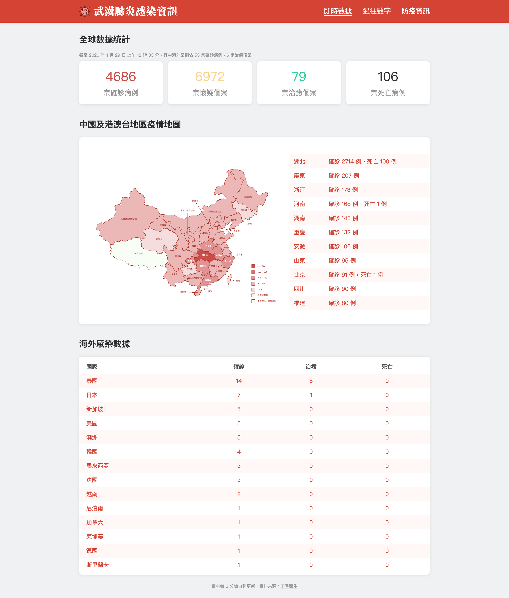

# 新型冠狀病毒肺炎（武漢肺炎）感染即時資訊 #
> 取得新型冠狀病毒肺炎（武漢肺炎）感染的確診、疑似、治癒及死亡案例數目。

### 功能 ###
* 即時全球感染數字
* 中國及港澳台地區疫情地圖
* 海外感染數據
* 歷史數據
* 香港急症室輪候時間
* 炒賣口罩藥房名單
* 防疫資訊

### WIP ###
* 相關新聞
* 香港數據

### 資料來源 ###
* 中國地圖：[china-geojson](https://github.com/yezongyang/china-geojson)
* 感染資訊：[全国新型肺炎疫情实时动态](https://3g.dxy.cn/newh5/view/pneumonia)
* 歷史數據：[实时更新：新型肺炎疫情最新动态](https://news.qq.com/zt2020/page/feiyan.htm#prevent)
* 急症室等候時間：[資料一線通 | DATA.GOV.HK - 按醫院劃分的急症室等候時間 (繁體中文)](https://data.gov.hk/tc-data/dataset/hospital-hadata-ae-waiting-time/resource/9fe0ddc4-e56a-4073-95ae-134b4c0ab3b1)
* 中文繁簡轉換：[PHP-Chinese](https://github.com/steelywing/PHP-Chinese)

## Developemnt Notes ##
* [Setup Guide](docs/DEVELOPMENT_NOTES.md)
* [References](docs/REFERENCES.md)
* [Roadmap](docs/ROADMAP.md)
* [Change Log](docs/CHANGELOG.md)
